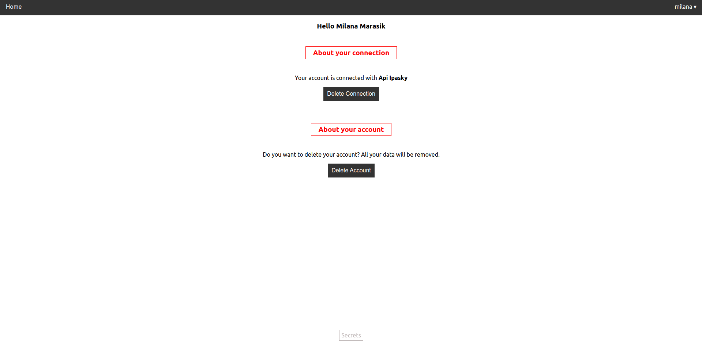

# TA-DA 

## CRUD app with React.js

TA-DA is a CRUD application (Copy, Read, Upload, Download) designed to track and improve the quality of romantic relationships.

User's data can only be accessed through secure sign up and login process:

In order to use the app, the user needs to connect it to his/her/their partner, exchanging their IDs:

After that, both accounts are connected and the partners can proceed to fullfil a weekely survey about their relationship:

The user can also easily delete the account connection to that of his/her/their partner, and also completely remove the personal account (erading all info in the database aswell).

### Technology Stack

* React.js
* Webtocken
* mongodb
* HTML
* Basic CSS stlying

